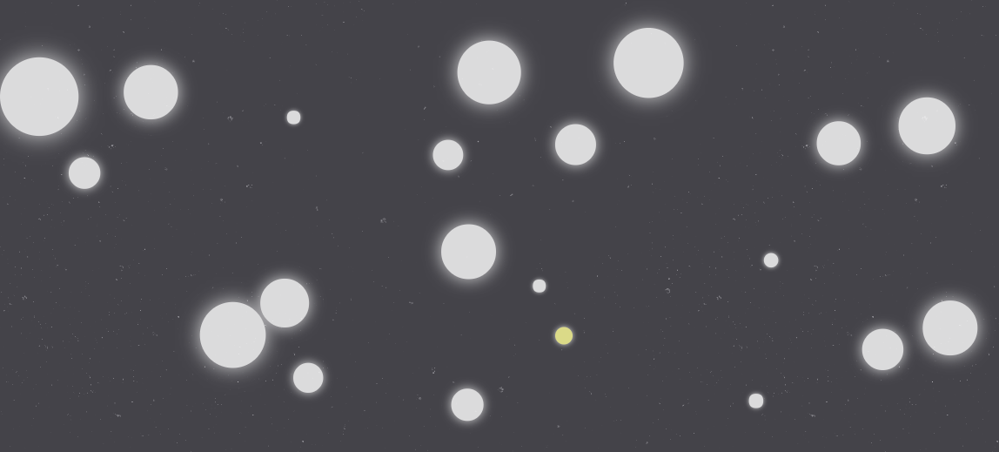

# Katamari

This is a simple browser version of Katamari Damacy, using EaselJS and Howler.js to make a full interactive experience. Simple vector math was used to simulate physically acccurate elastic collisions between the objects/clumps, and sounds for collisions came from the Hatnote Listen to Wikipedia project, creating a (hopefully) calming and new musical experience with each play.

## Background

Katamari (clump) Damacy (soul) is a Japanese game series, in which the player is a tiny ball that, through rolling over other smaller object, continues to grow and take over other objects, culminating in the taking over of planets and universe. I made a simple form of that using two dimensions, and circles of varying sizes. This was written over the span of 5 mornings, as part of my App Academy front end project.

## Functionality & MVP

### Moving Pieces

Easel.js with HTML5 canvas were used to display the moving objects. Through requestAnimationFrame, the canvas is consistently updated at the appropriate frame rate, allowing for fluid motion.

### Elastic Collisions

As moving objects hit one another, the system uses vectors to calculate the new velocity and direction. With each impact, the object's sound is played, creating a natural harmony within the game. To dramatically decrease the number of calculations and comparisons between objects, spacial partitioning was implemented. This reduced the number of calculations down from 40 factorial to 5 factorial.

### Sounds

The chimes were provided per the Hatnote project, and were implemented using Howler.js, in which each collision leads to a call to play the chime.

## Technologies

This project was implemented with the following technologies:

- Vanilla JavaScript/ES6 for the game logic and moving pieces,
- jQuery for the about sidebar, and welcome screens
- Easel.js with HTML5 Canvas for DOM manipulation and rendering,
- Howler.js to load and play interaction sounds
- Webpack to bundle and serve up the various scripts.
